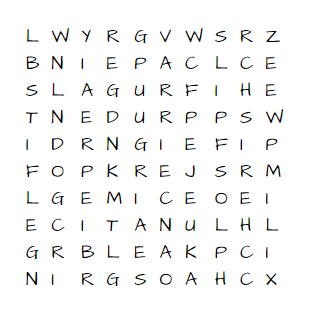

# word-hunt
A program in C++ to find all words with their location in word hunt puzzles.

This is a C++ program that uses a dictionary of words to find words matching the criteria.
It uses the trie data structure to do efficient searches.

The maze is 

Rules of the game :-

1) From the maze of letters, find as many legitimate words of four or more letters that you can.
2) Words are arranged horizontally, vertically and diagonally and can be either spelled forwards or backwards.
3) Also, words must not be formed by connecting letters in a combination of horizontal, vertical or diagonal arrangement.
4) Provide where in the maze you found the word.

I found the dictionary from https://github.com/dwyl/english-words/blob/master/words_alpha.txt

Tested on macos VS Code. Runtime is around 1 second on my Macbook Air.

testuser@Mohammads-MacBook-Air word-hunt % ./word-hunt  
51  
cherish start x=8 y=8 end x=2 y=8  
prudent start x=3 y=6 end x=3 y=0  
lunatic start x=7 y=7 end x=7 y=1  
frugal start x=2 y=6 end x=2 y=1  
stifle start x=2 y=0 end x=7 y=0  
bleak start x=8 y=2 end x=8 y=6  
feign start x=4 y=7 end x=4 y=3  
arrie start x=1 y=5 end x=5 y=5  
wisen start x=3 y=9 end x=7 y=5  
niepa start x=1 y=1 end x=1 y=5  
genes start x=9 y=3 end x=5 y=7  
prude start x=3 y=6 end x=3 y=2  
guijo start x=2 y=3 end x=6 y=7  
chaos start x=9 y=8 end x=9 y=4  
rugal start x=2 y=5 end x=2 y=1  
frug start x=2 y=6 end x=2 y=3  
ruga start x=2 y=5 end x=2 y=2  
dent start x=3 y=3 end x=3 y=0  
rude start x=3 y=5 end x=3 y=2  
gals start x=2 y=3 end x=2 y=0  
slag start x=2 y=0 end x=2 y=3  
sire start x=3 y=8 end x=6 y=8  
wise start x=3 y=9 end x=6 y=6  
cape start x=1 y=6 end x=1 y=3  
arri start x=1 y=5 end x=4 y=5  
regd start x=0 y=3 end x=3 y=3  
ordu start x=5 y=1 end x=2 y=4  
kink start x=5 y=3 end x=8 y=6  
jerk start x=5 y=6 end x=5 y=3  
lord start x=6 y=0 end x=3 y=3  
gils start x=6 y=1 end x=9 y=4  
emic start x=6 y=2 end x=6 y=5  
mice start x=6 y=3 end x=6 y=6  
oeci start x=6 y=7 end x=6 y=4  
eris start x=6 y=8 end x=3 y=8  
tice start x=7 y=3 end x=7 y=0  
luna start x=7 y=7 end x=7 y=4  
pein start x=1 y=4 end x=1 y=1  
limp start x=7 y=9 end x=4 y=9  
lese start x=7 y=9 end x=4 y=6  
blea start x=8 y=2 end x=8 y=5  
eure start x=1 y=3 end x=4 y=6  
leak start x=8 y=3 end x=8 y=6  
cher start x=8 y=8 end x=5 y=8  
slip start x=0 y=7 end x=3 y=7  
clee start x=8 y=8 end x=5 y=5  
grin start x=9 y=3 end x=9 y=0  
gene start x=9 y=3 end x=6 y=6  
gean start x=0 y=4 end x=3 y=1  
chao start x=9 y=8 end x=9 y=5  
fits start x=5 y=0 end x=2 y=0  

DONE!
